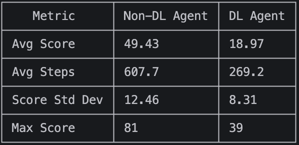

# Snake Game Agent

## Motivation and Task Context

We wanted to build an agent for a task that's visual and easy to understand but still has real decision-making involved. Snake felt like a good fit because the rules are simple (move around, eat food, don't crash), but the agent has to deal with a growing body and changing environment that makes the board harder to navigate over time.

## Architecture

### Game Environment

The game runs on a 15x15 grid, as defined by the environment in `snake/game.py`.

- `reset()` starts a fresh game and gives back the board
- `step(action)` takes a move and returns the updated board, a reward, and whether the game ended

The board is a numpy array where 0 means empty, 1 means snake, and 2 means food. The agent gets +1 for eating food, -10 for dying, either by hitting a wall or itself.

### Non-Deep Learning Agent

Located in `non_dl_approach.py`.

- **Perception**: Looks at the game state to find where the head is, where the body segments are, and where the food is.
- **Planning**: Uses breadth-first search to find the shortest path from the head to the food, avoiding any cells that the snake's body is currently on.
- **Control**: Moves one step along that path. If no path to the food exists, like if the body is blocking every route, it just picks any move that won't kill it immediately.

**Why this approach?**: Every move costs the same (one step), so BFS always gives the shortest path. There is no need for a complex priority queue or heuristics in this scenario. The main downside is that it doesn't think ahead about where the body will be in future steps, so it can accidentally trap itself once the snake gets too long.

### Deep Learning Agent

Located in `dl_approach.py`.

- **Perception**: Extracts 11 features from the board. Checks whether the cell ahead, to the right, or to the left of the head is dangerous (wall or snake body)
- **Planning**: Uses a Deep Q-Network (DQN) trained via reinforcement learning. The network maps the 11 features to Q-values for each of the possible actions. During training, the agent uses epsilon-greedy exploration and learns from a replay buffer of past experiences, using a separate target network
- **Control**: Takes the action with the highest Q-value output by the network

**Why this approach?**: DQN fits for snake because the agent can learn from trial and error. The 11-feature vector keeps training fast while still capturing the spatial information the agent needs. The tradeoff is that during training, most of the board information is discarded and the agent sees immediate direction and food direction, not the full layout. Unlike BFS, it has no guarantee of reaching the food.

## Evaluation Approach and Results

We evaluate both agents on the same game environment using the shared `agent.get_action(game)` interface. Each agent plays 100 games to get enough data to get stable averages and see how consistent each agent is.

The metrics tracked are:

- Average score (how much food the agent eats per game)
- Average game length (how many steps it survives)
- Score standard deviation (how much the score varies from game to game, lower means more consistent)

### Results
The BFS agent performed significantly better than the Deep Learning agent. This is expected as BFS finds the optimal path while the DL agent learned heuristics from a limited 1000 episode training run. The DL agent is more consistent (lower Std Dev) but plays shorter, less productive games. This can be improved with more training episodes.



## Running the Agent

### Setup

Install requirements:
```
pip install -r requirements.txt
```

Launch the UI:

```
streamlit run main.py
```

This opens a Streamlit app where you can pick an agent, adjust the speed, and watch it play. The sidebar has start/pause/reset buttons and shows live stats.
